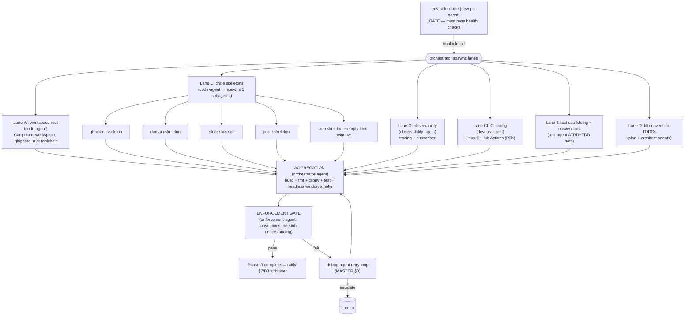

# PHASE 0 — Skeleton / Scaffold (Multiagent Execution Plan)

**Status:** Draft (awaiting approval) · **References:** [MASTER.md](./MASTER.md) · scope per
[MASTER Revisions R2b](./MASTER.md#revisions) (**Linux-only v1**)
**Goal:** Stand up the Cargo workspace (5 crates), **Linux** CI, `tracing`, and an empty Iced
window — plus ratify the test/convention gaps MASTER flagged. No GitHub integration yet.

**Exit criteria:** `cargo build`, `cargo fmt --check`, `cargo clippy -D warnings`, and
`cargo test` all green across the workspace; `cargo run -p app` opens an empty Iced window
(verified headless via xvfb); test conventions (§7) and `core-conventions` TODOs ratified.

---

## 1. Conventions loaded
Per [MASTER §1](./MASTER.md). Phase-0 additionally **fills** the empty `core-conventions` TODOs
(B8) and ratifies the **test framework** (B7) — these are deliverables, flagged for your sign-off.

## 2. Environment manifest (Step 4)

| Service / process | Purpose | Start (pipeline-owned) | Health check | Stop |
|---|---|---|---|---|
| Rust toolchain (rustc, cargo) | build | `rustup toolchain install stable` (verify if present) | `cargo --version` | n/a |
| clippy + rustfmt | lint/format | `rustup component add clippy rustfmt` | `cargo clippy -V`, `cargo fmt -V` | n/a |
| Iced/wgpu system libs (Linux) | windowing/GPU | install `libxkbcommon`, `libwayland`, `libx11`, mesa (vulkan/GL) dev pkgs | link check via `cargo build -p app` | n/a |
| `xvfb` + software GL (llvmpipe) | headless window smoke (B5) | start `Xvfb :99`; `DISPLAY=:99` | window opens & paints 1 frame | kill Xvfb pid |
| `cargo-watch` | live rebuild for dev lanes | `cargo install cargo-watch` | `cargo watch -V` | kill watcher |
| `cargo-llvm-cov` | coverage | `cargo install cargo-llvm-cov` | `cargo llvm-cov -V` | n/a |

**Dependency:** env-setup is the hard gate (MASTER §4) — nothing below starts until all health
checks pass. No human action required in Phase 0 (no PAT/cert needed yet).

## 3. Execution map (Step 6.4)

## 4. Lanes & subagent specification (Step 6.5)

| Subagent | Parent | Scope | Inputs | Outputs | Convention constraints | Depends on |
|---|---|---|---|---|---|---|
| env-setup | devops-agent | Manifest §2 | host | running toolchain+xvfb+watchers; start/stop doc | MASTER §4 | — (gate) |
| workspace-root | code-agent | `Cargo.toml` workspace, `rust-toolchain.toml`, deny-warnings lints | ARD AD-7 | workspace manifest | one-type-per-file N/A; member list = AD-7 | env-setup |
| crate:gh-client | code-agent | empty lib crate + module skeleton (no logic) | AD-7/AD-8 | compiling `gh-client` | thiserror error enum stub-free (only type defs) | workspace-root |
| crate:domain | code-agent | type module layout (Author/Item/Category placeholders as real empty enums/structs, no logic) | AD-5 | compiling `domain` | derives Debug/Clone/Serde; one-type-per-file | workspace-root |
| crate:store | code-agent | lib + rusqlite dep wired, no schema yet | AD-6 | compiling `store` | — | workspace-root |
| crate:poller | code-agent | lib skeleton | AD-7 | compiling `poller` | — | workspace-root |
| crate:app | code-agent | bin + **empty Iced window that runs** | AD-2 | runnable `app` | real `iced::run`, no `todo!()` | workspace-root |
| observability | observability-agent | `tracing` init + `tracing-subscriber` env filter in `app` | — | logging works | no secrets in logs | crate:app |
| ci-config | devops-agent | GH Actions: build+fmt+clippy+test on **ubuntu only** (R2b) + xvfb step; structured so adding mac/win runners later is a matrix addition | §2 | `.github/workflows/ci.yml` | YAML lint clean | workspace-root |
| atdd-scaffold | test-agent (ATDD) | acceptance harness + "app launches" scenario | §7 | `tests/` acceptance skeleton + 1 live smoke | §7 patterns | crate:app |
| tdd-scaffold | test-agent (TDD) | per-crate `#[cfg(test)]` smoke + wiremock dev-dep wired | §7 | passing trivial tests per crate | §7 patterns | crate:* |
| conventions-fill | plan-agent + architect-agent | fill `core-conventions` TODOs (repo structure, error pattern, commit style=Conventional, PR size) | general.md, ARD | updated convention docs (flagged for ratification) | demonstrate fit (§3.6) | — |

**Understanding requirement (§3.6) example:** crate:app must justify *why* Iced's
Elm/`Application` model fits an idle-most dashboard (retained redraw-on-message) — not just
"because we picked Iced".

## 5. Convention enforcement (Step 6.6)
- naming/structure: enforcement-agent checks snake_case files, one-type-per-file, workspace = AD-7.
- no-stub: grep for `todo!|unimplemented!|unreachable!\(\)\s*//placeholder`; the empty Iced window
  must be a *real* running window, not a panic.
- new deps: every crate in AD-8 already flagged in ARD; any extra → pause + re-present (§3.7).
- format/lint gate: `fmt --check`, `clippy -D warnings`.

## 6. Test strategy (Step 6.7)
- **ATDD:** "Running `app` opens a window and renders one frame without panic" (headless xvfb).
- **TDD:** trivial but real per-crate unit test (e.g. `domain` enum round-trips serde) to prove
  the test harness + coverage tooling work. `wiremock` wired as dev-dep for later phases.
- Validated at aggregation against [MASTER §7](./MASTER.md).

## 7. Integration verification (Step 6.8)
No external system boundary this phase. The only "integration" is **toolchain ↔ GPU/display**:
verified by the headless window smoke (renders a frame under xvfb/llvmpipe). Documented in env-setup output.

## 8. Gap report (Step 6.9)
- B5 (headless GPU) actively resolved here via xvfb/llvmpipe; if the runner lacks even software
  GL → blocker, escalate.
- B7/B8: this phase *produces* the missing conventions; they remain provisional until you ratify.
- No B1/B2/B6 exposure yet.

## 9. Debug & retry (Step 6.10)
Per [MASTER §8](./MASTER.md). Most likely failure: Iced/wgpu link or headless-GL. Retry ladder:
re-run crate:app subagent with adapter forced to software → re-run env-setup lane to add GL libs
→ escalate B5.

## 10. Aggregation & gate
orchestrator-agent: full build+fmt+clippy+test+coverage+window-smoke green → enforcement-agent
sign-off → **present ratification of §7/B8 to you** → update session → Phase 0 closed.
