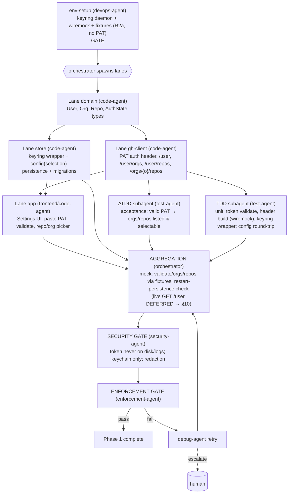

# PHASE 1 — Auth + Scope (Multiagent Execution Plan)

**Status:** Draft (awaiting approval) · **References:** [MASTER.md](./MASTER.md) ·
**R2a mock-first** (no PAT) / **R2b Linux-only**
**Goal:** PAT entry → OS keychain; validate token; list user orgs/repos; persist selection.
**Exit criteria (R2a):** against the **mock GitHub server + recorded fixtures**, the app's auth
flow validates a token, lists orgs & repos, lets the user select a subset, and the selection
survives restart. Token (a **dummy** in dev) lives in the keychain only. **Live `GET /user`
verification is DEFERRED to the §10 pass** when you supply a PAT.

---

## 1. Conventions loaded
Per [MASTER §1](./MASTER.md). New-dep flag: `keyring`, `directories` (both in ARD AD-8).

## 2. Environment manifest (Step 4)

| Service / process | Purpose | Start (pipeline-owned) | Health check | Stop |
|---|---|---|---|---|
| Phase-0 toolchain + xvfb + watchers | build/run/test | reuse Phase-0 setup | as Phase 0 | as Phase 0 |
| **dbus + gnome-keyring-daemon** (Linux) | Secret Service for `keyring` (B3) | start dbus session; `gnome-keyring-daemon --start --components=secrets`; unlock with throwaway pass | write+read a probe secret | kill daemons |
| **`wiremock` mock GitHub server** | replay recorded `/user`, `/user/orgs`, `/user/repos` fixtures (R2a) | in-process / local port | mock returns fixture 200 | test teardown |
| **`tests/fixtures/` (recorded real payloads)** | auth/scope shapes | author from schema now; replace at first capture | fixtures present + schema-valid | n/a |
| SQLite (bundled via rusqlite) | persist selection/config | n/a (embedded) | open temp db, run migration | n/a |

**No PAT this phase (R2a).** env-setup readiness = keyring daemon + mock server + fixtures (not a
PAT). The keychain wrapper is exercised with a **dummy token string**. Live `api.github.com`
auth is **not** done here — it's the deferred §10 pass. (No human secret input required to start.)

## 3. Execution map (Step 6.4)

## 4. Lanes & subagent specification (Step 6.5)

| Subagent | Parent | Scope | Inputs | Outputs | Convention constraints | Depends on |
|---|---|---|---|---|---|---|
| env-setup | devops-agent | §2: keyring daemon + wiremock + fixtures (no PAT, R2a) | host | keyring up, mock serving fixtures | MASTER §4 | gate |
| domain-auth-types | code-agent | `User{login,type}`, `Org`, `Repo`, `AuthState`, `RepoSelection` | ARD AD-5 | typed crate additions | derives Serde/Debug/Clone; one-type-per-file | env-setup |
| ghc-auth | code-agent | auth header injection, `GET /user`, `/user/orgs`, `/user/repos`, `/orgs/{o}/repos` (paginated); base URL injectable so tests point at wiremock | domain types | functions returning `Result<…, GhError>` | thiserror `GhError`; no panics; real reqwest (against mock now) | domain-auth-types |
| store-keyring | code-agent | `keyring` wrapper (set/get/delete token), config table + selection persistence + migration v1 | domain types | store API | token only via keyring; sqlite for selection | domain-auth-types |
| app-settings | code-agent (frontend hat) | Iced settings view: PAT field (masked), Validate button, org/repo multi-select, persist | ghc-auth, store-keyring | working settings screen | no token in widget logs; accessible labels | ghc-auth, store-keyring |
| atdd-auth | test-agent (ATDD) | acceptance scenarios (valid/invalid token, scope select, restart persistence) against mock | §7 | acceptance tests (mock) | live re-run deferred §10 | ghc-auth |
| tdd-auth | test-agent (TDD) | unit: header build + validate (wiremock), keyring wrapper (real daemon, dummy token), config round-trip; integration: against wiremock fixtures | §7 | passing tests + coverage | Stage-1 fixtures; Stage-2 live deferred | ghc-auth, store-keyring |

**Understanding requirement (§3.6):** store-keyring must justify *why* OS keychain (not an
encrypted file) — OS-managed secret lifecycle, per-user isolation, no key-management burden —
tied to the privacy invariant.

## 5. Convention enforcement (Step 6.6)
- security-agent gate: assert token never written to sqlite, config files, or logs (grep + log
  capture); masked in UI; `Debug` impls redact it.
- thiserror error taxonomy reviewed (`GhError`: Network, Unauthorized, RateLimited, Decode…).
- no-stub scan; fmt/clippy gates; new-dep check (keyring/directories only).

## 6. Test strategy (Step 6.7)
- **ATDD (mock):** valid token (fixture) → orgs+repos appear & selectable; invalid token → clear
  error, no crash; selection persists across restart.
- **TDD:** token validation, paginated repo listing (wiremock fixtures), keyring set/get/delete
  against the real daemon (dummy token), config serialization round-trip.
- **Deferred (§10):** re-run the same auth/scope tests against real `api.github.com` with a PAT.

## 7. Integration verification (Step 6.8)
Boundaries: **GitHub REST auth/scope** and **OS keychain**. **OS keychain is verified live now**
(real `keyring` write→read→delete via the Secret Service — no PAT needed). **GitHub REST
auth/scope is verified against recorded fixtures now (Stage 1); live verification DEFERRED to the
§10 pass (R2a).** The base URL is injectable so the deferred pass needs no code change — only a PAT.

## 8. Gap report (Step 6.9)
- **B1 PAT** — *deferred, not blocking* (R2a): dev proceeds on fixtures; live auth waits for §10.
- **B3 keyring daemon** — pipeline starts it; verified live with a dummy token.
- **B2 data** — `/user`/orgs/repos fixtures authored now, recorded from real account at first
  capture. No sandbox repo needed this phase.

## 9. Debug & retry (Step 6.10)
Per [MASTER §8](./MASTER.md). Likely failures: Secret Service not running (re-run env-setup),
pagination edge (subagent retry), fixture vs schema mismatch (refresh fixture). PAT-scope issues
surface only in the deferred §10 pass.

## 10. Aggregation & gate
orchestrator: mock auth + scope + **live keychain** + restart-persistence green → **security-agent**
sign-off (token hygiene) → enforcement-agent → session update → Phase 1 closed
(**live GitHub verification: DEFERRED — R2a/§10**).
