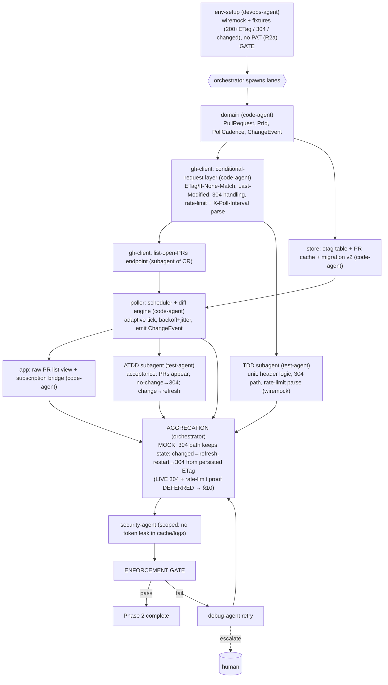

# PHASE 2 — Poller Core (Multiagent Execution Plan)

**Status:** Draft (awaiting approval) · **References:** [MASTER.md](./MASTER.md) ·
**R2a mock-first** (no PAT) / **R2b Linux-only**
**Goal:** Conditional-request polling engine: list open PRs for selected repos, persist ETags,
diff against cache, show a raw list that refreshes cheaply (304s).
**Exit criteria (R2a):** against **wiremock fixtures** the poller honors `X-Poll-Interval`, sends
`If-None-Match`, handles a **304 fixture** without disturbing parsed state, detects a **changed
fixture** as a diff, renders/updates the list, and reloads ETags on restart (304 path). **The
*live* proof that a real 304 leaves `X-RateLimit-Remaining` untouched is DEFERRED to the §10
pass** (it's the core evidence for AD-1, run with a PAT).

---

## 1. Conventions loaded
Per [MASTER §1](./MASTER.md). New-dep flag: none beyond ARD (reqwest/tokio already in AD-8).

## 2. Environment manifest (Step 4)

| Service / process | Purpose | Start | Health check | Stop |
|---|---|---|---|---|
| Phase-0/1 toolchain, keyring | build/run | reuse | as before | as before |
| **`wiremock` GitHub mock** | serve `/pulls?state=open` with **ETag**, a **304** response to `If-None-Match`, and a **changed** variant (R2a) | local port | mock returns 200+ETag, then 304, then changed | teardown |
| **`tests/fixtures/`**: pulls list + 304 + changed + rate-limit headers | drive list/diff/304/rate-limit-parse | authored now, recorded later | schema-valid | n/a |
| tokio runtime | async poll loop | in-process | loop tick logged | app exit |

**No PAT/sandbox this phase (R2a).** 304-on-no-change and refresh-on-change are exercised by the
mock serving a 304 then a changed body — proving our *client* logic. Whether GitHub *actually*
returns 304 without spending rate limit is an API fact verified later in §10 with a real,
mutable repo (you nominate one then).

## 3. Execution map (Step 6.4)

## 4. Lanes & subagent specification (Step 6.5)

| Subagent | Parent | Scope | Inputs | Outputs | Convention constraints | Depends on |
|---|---|---|---|---|---|---|
| env-setup | devops-agent | §2: wiremock + 200/304/changed fixtures (no PAT) | host | ready mock env | MASTER §4 | gate |
| domain-poll-types | code-agent | `PullRequest`, `PrId`, `PollCadence`, `ChangeEvent`, `RateLimitState` | ARD | types | derives; one-type-per-file | env-setup |
| ghc-conditional | code-agent | conditional-request middleware: store/send ETag+Last-Modified, map 304, parse `X-RateLimit-*` + `X-Poll-Interval` | domain | reusable request layer | thiserror; **must demonstrate why conditional requests (304 free) fit low-impact goal** | domain |
| ghc-list-prs | code-agent (subagent of ghc-conditional) | `GET /repos/{o}/{r}/pulls?state=open` paginated via the conditional layer | ghc-conditional | typed PR lists + etag | per-repo etag keyed | ghc-conditional |
| store-etag-cache | code-agent | `etags` table, PR cache table, migration v2, restart-load | domain | persistence API | snake_case tables | domain |
| poller-core | code-agent | tokio scheduler (adaptive tick), diff cache vs fresh, emit `ChangeEvent`, backoff+jitter, obey `X-Poll-Interval` | ghc-list-prs, store-etag-cache | running poll loop | no busy-wait; cancellation-safe | ghc-list-prs, store-etag-cache |
| app-prlist | code-agent | Iced subscription bridge + raw PR list view | poller-core | live list | redraw-on-event only | poller-core |
| tdd-poller | test-agent (TDD) | unit: 304 path, etag persistence, diff engine, rate-limit/poll-interval parse (wiremock); integration: real poll | §7 | passing tests | wiremock unit-only | ghc-conditional, store-etag-cache |
| atdd-poller | test-agent (ATDD) | acceptance: appear / 304-no-change / refresh-on-change / restart-304 against mock | §7 | acceptance (mock) | wiremock fixtures (live deferred §10) | poller-core |

**Understanding requirement (§3.6):** poller-core must justify the **diff-then-event** design
(retained-mode UI consumes events; avoids full re-render) and the **adaptive-cadence + jitter**
choice (thundering-herd avoidance, low idle cost) — not copy a generic polling loop.

## 5. Convention enforcement (Step 6.6)
- enforcement-agent: thiserror taxonomy extended (`RateLimited{reset_at}`), no panics in loop,
  cancellation-safety, no token in cache rows/logs.
- no-stub scan (the diff engine must be real); fmt/clippy; cadence values from config not magic.

## 6. Test strategy (Step 6.7)
- **ATDD (mock):** (a) open PRs from fixture listed; (b) second poll → mock returns 304 → parsed
  state unchanged, no re-render churn; (c) mock switches to changed body → next poll shows the
  diff; (d) restart → first poll sends persisted ETag → 304.
- **TDD:** conditional header construction, 304 short-circuit, ETag store CRUD, diff (added/
  removed/updated), rate-limit + poll-interval header parsing (wiremock).
- **Deferred (§10):** same tests against a real mutable repo asserting **304 + unchanged
  `X-RateLimit-Remaining`**.

## 7. Integration verification (Step 6.8)
Boundary: **GitHub REST list + conditional-request semantics**. **Stage 1 (now):** our client's
304/diff/ETag handling verified against wiremock fixtures. **Stage 2 (DEFERRED, §10):** assert an
*actual* GitHub `304` *and* that `X-RateLimit-Remaining` did not decrement — the concrete proof
that AD-1's "free idle polling" holds — plus refresh-on-change against a mutable repo.

## 8. Gap report (Step 6.9)
- **B1/B2 deferred (R2a):** the AD-1 rate-limit claim is *assumed* (well-documented) and proven
  in §10, not now. This is the single most important deferred verification — flagged so it isn't
  mistaken for done. Mock proves our client behaves correctly *given* a 304.

## 9. Debug & retry (Step 6.10)
Per [MASTER §8](./MASTER.md). Likely: server returns 200 instead of 304 (etag not echoed
correctly — subagent retry on header logic); rate-limit hit during tests (backoff + lower test
cadence). Escalate if GitHub semantics differ from AD-1 assumptions (material change → re-present).

## 10. Aggregation & gate
orchestrator runs the mock 304/refresh/restart proof → security-agent (token hygiene in cache)
→ enforcement-agent → session update → Phase 2 closed (**live 304 + rate-limit proof: DEFERRED —
R2a/§10**).
