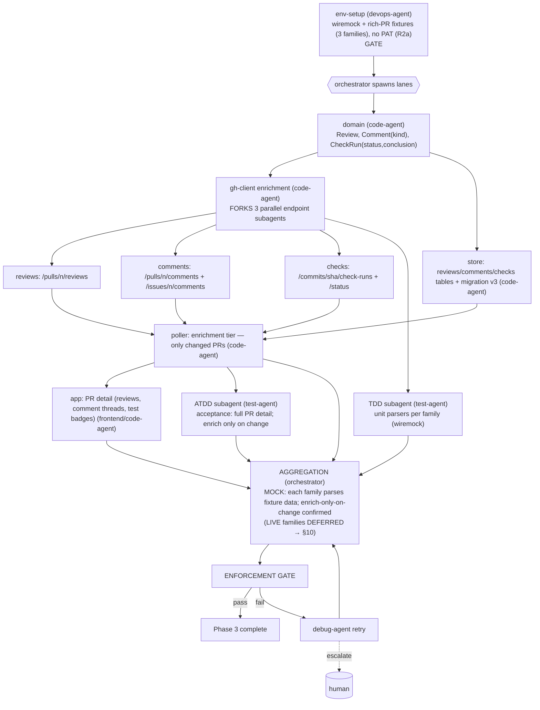

# PHASE 3 — Enrichment (Multiagent Execution Plan)

**Status:** Draft (awaiting approval) · **References:** [MASTER.md](./MASTER.md) ·
**R2a mock-first** (no PAT) / **R2b Linux-only**
**Goal:** For changed PRs, fetch reviews, comments (issue + review), and check-runs/status (test
results); render pass/fail/pending and comments in the feed.
**Exit criteria (R2a):** each open PR shows its reviews, comment threads (attributed), and
test-result status; enrichment only fires for PRs that changed (cheap) — all proven against
**recorded fixtures** for the three families. **Live verification DEFERRED to §10.**

---

## 1. Conventions loaded
Per [MASTER §1](./MASTER.md). No new runtime deps (still REST; GraphQL deferred per ARD AD-3/AD-9).

## 2. Environment manifest (Step 4)

| Service / process | Purpose | Start | Health check | Stop |
|---|---|---|---|---|
| Phase-0..2 env (toolchain, keyring, tokio) | base | reuse | as before | as before |
| **`wiremock` + `tests/fixtures/`**: a rich PR — reviews, issue+review comments, check-runs/status (R2a) | verify all 3 families | authored now, recorded later | mock serves each family non-empty | teardown |

**No PAT/sandbox this phase (R2a).** Fixtures supply a *rich* PR covering every family. Live
verification against a real reviewed/commented/CI'd PR is the §10 deferred pass.

## 3. Execution map (Step 6.4)

## 4. Lanes & subagent specification (Step 6.5)

| Subagent | Parent | Scope | Inputs | Outputs | Convention constraints | Depends on |
|---|---|---|---|---|---|---|
| env-setup | devops-agent | §2: wiremock + rich-PR fixtures (no PAT) | host | ready mock env | MASTER §4 | gate |
| domain-enrich-types | code-agent | `Review`, `Comment{kind: Issue\|Review}`, `CheckRun{status, conclusion}`, `TestSummary` | ARD | types | derives; one-type-per-file | env-setup |
| ghc-reviews | code-agent (subagent of enrichment) | `GET /pulls/{n}/reviews` conditional | domain, Phase-2 layer | typed reviews | reuse conditional layer | domain |
| ghc-comments | code-agent (subagent) | issue + review comments, merged + attributed | domain | typed comments | reuse layer | domain |
| ghc-checks | code-agent (subagent) | check-runs + combined status → `TestSummary(pass/fail/pending)` | domain | typed checks | reuse layer | domain |
| store-enrich | code-agent | tables for reviews/comments/checks + migration v3 | domain | persistence | snake_case | domain |
| poller-enrich | code-agent | enrichment tier: trigger only for PRs whose change-detect (Phase 2) fired | ghc-*, store-enrich | enriched events | no full refetch | ghc-*, store-enrich |
| app-prdetail | code-agent (frontend hat) | render reviews, threaded comments, test badges | poller-enrich | detail UI | accessible; redraw-on-event | poller-enrich |
| tdd-enrich | test-agent (TDD) | per-family parser units (wiremock) + integration live | §7 | passing tests | wiremock unit-only | ghc-* |
| atdd-enrich | test-agent (ATDD) | acceptance: full detail; enrich fires only on change (mock) | §7 | acceptance (mock) | fixtures (live deferred §10) | poller-enrich |

**Understanding requirement (§3.6):** poller-enrich must justify **two-tier** design (cheap
change-detect → targeted enrich) over refetch-all (rate-limit + CPU), tying back to AD-3.

## 5. Convention enforcement (Step 6.6)
- enforcement-agent: comment attribution carries author identity for Phase-4 classification; no
  N+1 explosion (batch per changed PR); thiserror per family; no-stub; fmt/clippy.

## 6. Test strategy (Step 6.7)
- **ATDD (mock):** the fixture PR shows reviews, comments (correct author + kind), and test
  status; an unchanged PR triggers **no** enrichment calls (assert via wiremock request log).
- **TDD:** parser units for each family incl. empty/paginated/failure payloads (wiremock);
  status→summary mapping (success/failure/neutral/pending).
- **Deferred (§10):** live per-family fetch against a real rich PR.

## 7. Integration verification (Step 6.8)
Boundaries: **reviews, comments (×2), check-runs/status**. **Stage 1 (now):** each parsed
correctly from recorded fixtures; enrichment-gating verified by the mock request log showing zero
enrich calls on a no-change cycle. **Stage 2 (DEFERRED, §10):** each family hit live against a
real rich PR returning the expected entities.

## 8. Gap report (Step 6.9)
- **B1/B2 deferred (R2a):** family fixtures authored from documented schemas now, recorded from a
  real PR at first capture / §10. Flagged so "parses fixture" isn't read as "verified live".

## 9. Debug & retry (Step 6.10)
Per [MASTER §8](./MASTER.md). Likely: status vs check-runs ambiguity (a repo may use one or both)
→ subagent reconciles both into `TestSummary`; pagination on busy PRs → retry.

## 10. Aggregation & gate
orchestrator: mock three-family proof + enrich-only-on-change → enforcement-agent → session
update → Phase 3 closed (**live families: DEFERRED — R2a/§10**).
