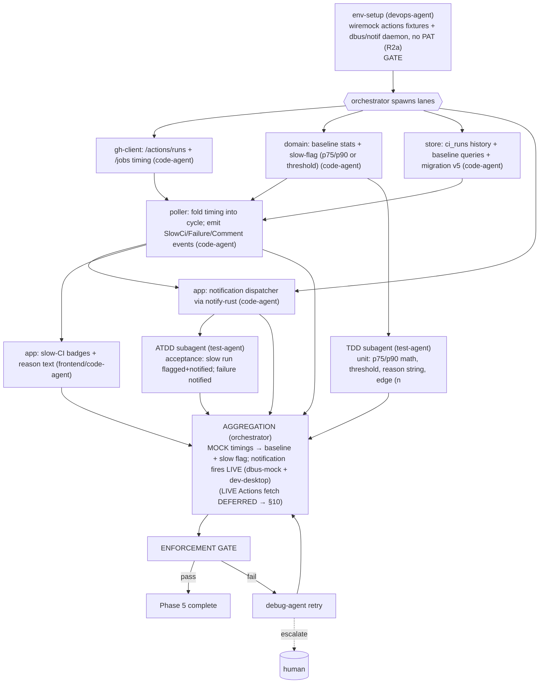

# PHASE 5 — CI/CD Timing + Alerts (Multiagent Execution Plan)

**Status:** Draft (awaiting approval) · **References:** [MASTER.md](./MASTER.md) ·
**R2a mock-first** (no PAT) / **R2b Linux-only notifications**
**Goal:** Pull Actions run/job timing, build rolling baselines, flag "too-long" runs (fixed
threshold OR p75/p90), and fire **Linux** desktop notifications for new failures / slow CI / new
comments.
**Exit criteria (R2a):** slow runs are flagged with a human-readable reason; a **real Linux
notification fires** (verified via dbus + dev desktop — needs no PAT); baseline math verified;
Actions-timing parsing verified against **fixtures**. **Live Actions verification DEFERRED to §10.**

---

## 1. Conventions loaded
Per [MASTER §1](./MASTER.md). New-dep flag: `notify-rust` (ARD AD-8). Baseline stats live in
**pure `domain`** (testable); persistence in `store`.

## 2. Environment manifest (Step 4)

| Service / process | Purpose | Start (pipeline-owned) | Health check | Stop |
|---|---|---|---|---|
| Phase-0..4 env | base | reuse | as before | as before |
| **`wiremock` + `tests/fixtures/`**: `/actions/runs` (+ `/jobs`) with varied durations (some slow) (R2a) | baseline + slow-flag proof | authored now, recorded later | mock serves runs of varying duration | teardown |
| **dbus + notification daemon** (Linux, B4) | `notify-rust` delivery | start dbus session + a notif daemon (e.g. dunst/notification-daemon) | send probe notification, assert via `dbus-monitor`/dbus-mock | kill daemons |

**Notifications need no PAT** — they're triggered by fixture-sourced events, so this is verified
**live now** on Linux. Only the **Actions API fetch** is mocked now / deferred to §10. (mac/win
notification backends are post-v1, R2b.)

## 3. Execution map (Step 6.4)

## 4. Lanes & subagent specification (Step 6.5)

| Subagent | Parent | Scope | Inputs | Outputs | Convention constraints | Depends on |
|---|---|---|---|---|---|---|
| env-setup | devops-agent | §2: wiremock actions fixtures + notif daemon (no PAT) | host | ready mock env + daemon | MASTER §4 | gate |
| ghc-actions | code-agent | `GET /actions/runs` (+ `/jobs`) conditional; extract `run_started_at`/`updated_at`/conclusion | Phase-2 layer | typed runs/jobs | reuse layer; thiserror | env-setup |
| domain-baseline | code-agent | rolling p75/p90 over last N per `(repo,workflow)`; fixed-threshold mode; `SlowFlag{reason}` | run durations | pure stats + flag | pure, deterministic | env-setup |
| store-ci | code-agent | `ci_runs` history + baseline query + migration v5 | domain | persistence | snake_case | env-setup |
| poller-timing | code-agent | fold timing into poll cycle; emit `SlowCi`/`Failure`/`NewComment` events | ghc-actions, domain-baseline, store-ci | events | no busy-wait | ghc-actions, domain-baseline, store-ci |
| app-notify | code-agent | `Notifier` trait + **Linux/XDG impl** via `notify-rust` (mac/win impls post-v1, AD-10) + de-dupe | poller-timing | notifications | no token/PII in body; user-toggle; behind trait seam | poller-timing |
| app-badges | code-agent (frontend hat) | slow-CI badge + reason on items | poller-timing | UI | accessible | poller-timing |
| tdd-timing | test-agent (TDD) | p75/p90 math, threshold, reason text, n<window edge, de-dupe; integration: live `/actions/runs` | §7 | passing tests | wiremock unit-only | domain-baseline, ghc-actions |
| atdd-timing | test-agent (ATDD) | acceptance: slow fixture run → flagged+notified; failed run → notified | §7 | acceptance (mock data) + **live dbus** assertion | fixtures + real daemon (Actions live deferred §10) | app-notify |

**Understanding requirement (§3.6):** domain-baseline must justify **rolling percentile** over a
fixed threshold as the default (adapts per-workflow, no per-repo tuning) and why p75/p90 (not
mean — robust to outliers) — and the de-dupe rationale (avoid notification spam).

## 5. Convention enforcement (Step 6.6)
- enforcement-agent: stats pure in `domain`; notification body carries **no token/PII**;
  user-toggle respected; de-dupe present; no-stub; fmt/clippy.
- security-agent (light): notification content review (no secret leakage).

## 6. Test strategy (Step 6.7)
- **ATDD:** a known-slow **fixture** run is flagged with a sensible reason and triggers a
  notification (asserted via dbus-mock + observed on dev desktop); a failed run notifies.
- **TDD:** percentile math (incl. n<window → fallback to threshold/no-flag), threshold mode,
  reason-string formatting, event de-dupe, conclusion mapping.
- **Deferred (§10):** live `/actions/runs` timing against a real repo with run history.

## 7. Integration verification (Step 6.8)
Two boundaries, **different verification timing**: **desktop notification is verified LIVE now**
(real D-Bus `Notify` fired + asserted; on-screen render on dev desktop — no PAT needed). The
**Actions API fetch is Stage-1 fixture-verified now, live DEFERRED to §10.** Unverifiable
notification path (no daemon/desktop) = flagged partial, never stubbed.

## 8. Gap report (Step 6.9)
- **B1 deferred (R2a):** Actions timing fixtures now; live in §10. **B4 active:** notification
  verified via dbus + dev desktop now. Baseline needs several runs — with few fixtures it degrades
  to threshold mode; flagged. mac/win notification backends = post-v1 (R2b).

## 9. Debug & retry (Step 6.10)
Per [MASTER §8](./MASTER.md). Likely: flaky/missing notif daemon → re-run env-setup; baseline
window too small with few fixtures → degrade to threshold. (Per-OS backend differences are
post-v1, R2b — the `Notifier` trait isolates them.)

## 10. Aggregation & gate
orchestrator: (mock) timing + baseline + flag + **live notification** proof → enforcement + light
security → session update → Phase 5 closed (**live Actions fetch: DEFERRED — R2a/§10**).
