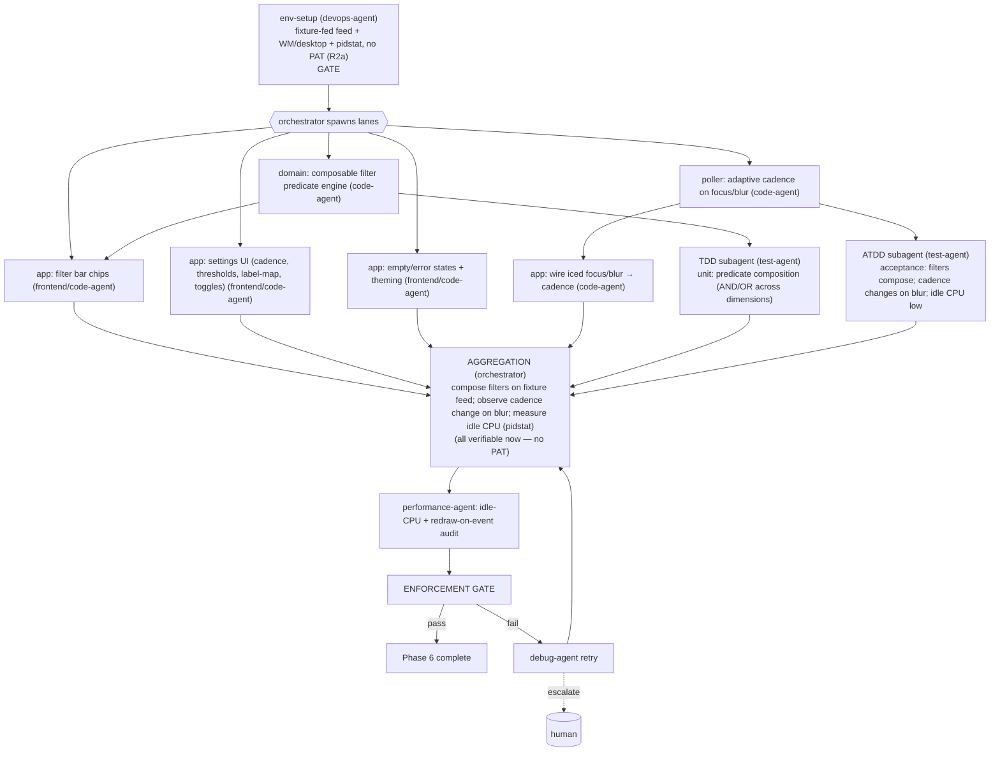

# PHASE 6 — Filters + Polish (Multiagent Execution Plan)

**Status:** Draft (awaiting approval) · **References:** [MASTER.md](./MASTER.md) ·
**R2a mock-first** (no PAT) / **R2b Linux-only**
**Goal:** Composable filter chips over all dimensions; adaptive poll cadence (focus/blur);
settings UI; empty/error states; theming — delivering the PRD experience.
**Exit criteria (R2a):** filters compose correctly over a **fixture-fed feed**; poll cadence
visibly changes on window focus/blur; settings persist; empty/error states render; idle CPU
measured negligible. (Cadence, idle-CPU, filters, and UI need **no PAT** — all verifiable now.)

---

## 1. Conventions loaded
Per [MASTER §1](./MASTER.md). Filter engine is **pure `domain`**; cadence + UI in `poller`/`app`.

## 2. Environment manifest (Step 4)

| Service / process | Purpose | Start | Health check | Stop |
|---|---|---|---|---|
| Phase-0..5 env | base | reuse | as before | as before |
| **`wiremock` + `tests/fixtures/`**: a populated multi-dimension feed (R2a) | real-shaped items to filter | authored now | mock serves a varied feed | teardown |
| xvfb / dev desktop (B5) | focus/blur events + idle-CPU measurement | reuse Phase-0; focus events need a window manager for true blur | window receives focus/blur | — |
| `/usr/bin/time` or `pidstat` | idle-CPU measurement | install `sysstat` | reads process CPU% | — |

**No PAT this phase (R2a).** The feed is fixture-fed; filters/cadence/idle-CPU are all observable
without GitHub. **B5**: true focus/blur needs a window manager; headless xvfb simulates events,
full proof on the dev desktop. Idle-CPU measured with pidstat over an idle window.

## 3. Execution map (Step 6.4)

## 4. Lanes & subagent specification (Step 6.5)

| Subagent | Parent | Scope | Inputs | Outputs | Convention constraints | Depends on |
|---|---|---|---|---|---|---|
| env-setup | devops-agent | §2: fixture feed + WM + pidstat (no PAT) | host | ready env | MASTER §4 | gate |
| filter-engine | code-agent | composable predicate over `{source,kind,category,scope,flags}`; AND within-not, OR within-dimension | domain items | pure filter API | pure; total over dimensions | env-setup |
| poller-cadence | code-agent | focus→fast / blur→slow cadence; obey `X-Poll-Interval` floor | poller (Phase 2) | adaptive cadence | no magic numbers (config) | env-setup |
| app-filterbar | code-agent (frontend hat) | chips toggling predicate terms; live count | filter-engine | filter UI | accessible; redraw-on-event | filter-engine |
| app-settings2 | code-agent (frontend hat) | cadence/threshold/label-map/notif toggles persisted | store | settings UI | persisted via store | env-setup |
| app-states | code-agent (frontend hat) | empty/loading/error states + theming (light/dark) | — | polished UI | accessible contrast | env-setup |
| app-focus | code-agent | wire Iced focus/blur events → poller-cadence | poller-cadence | focus wiring | event-driven | poller-cadence |
| tdd-filter | test-agent (TDD) | predicate composition matrices (multi-dimension, empty, all-on) | §7 | passing tests | pure-fn tests | filter-engine |
| atdd-polish | test-agent (ATDD) | acceptance: compose filters on fixture feed; blur slows poll; idle CPU below budget | §7 | acceptance + pidstat reading | fixture feed + desktop | app-filterbar, app-focus |
| perf-audit | performance-agent | idle CPU, redraw frequency (assert redraw only on change), memory | running app | perf report | NFR2 budget | aggregation |

**Understanding requirement (§3.6):** filter-engine must justify the **dimension algebra** (why
OR-within-dimension / AND-across — matches how chips read to a user) and poller-cadence must
justify focus-driven adaptation as the primary low-impact lever (NFR2), not a fixed interval.

## 5. Convention enforcement (Step 6.6)
- enforcement-agent: filter engine pure; cadence/thresholds config-driven (no magic numbers);
  redraw-on-event preserved (performance-agent confirms no per-frame redraw); no-stub; fmt/clippy.

## 6. Test strategy (Step 6.7)
- **ATDD:** toggling chips narrows the **fixture feed** correctly across combined dimensions;
  blurring the window measurably lengthens the poll interval; restoring focus shortens it; idle
  CPU under the NFR2 budget (pidstat).
- **TDD:** predicate composition truth tables; cadence transition logic incl. `X-Poll-Interval`
  floor clamp; settings persistence.

## 7. Integration verification (Step 6.8)
Boundary: **window-manager focus/blur ↔ poller cadence** — verified **live now** by observing the
actual poll interval change on real focus events (no PAT needed; the poll target is wiremock).
Filters run over the fixture feed. Idle-CPU is the NFR2 acceptance evidence, measured with
pidstat — not asserted by claim. (No GitHub boundary is newly introduced this phase.)

## 8. Gap report (Step 6.9)
- **B5**: true blur needs a WM; headless run simulates events but full proof is on dev desktop.
  Idle-CPU budget value + default cadence values to confirm with you (PRD OQ).
- No B1/B2 exposure — this phase is fully verifiable without a PAT.

## 9. Debug & retry (Step 6.10)
Per [MASTER §8](./MASTER.md). Likely: Iced focus events differ per platform → app-focus handles
per-OS; redraw storms (immediate-mode creep) caught by perf-audit → fix to event-driven.

## 10. Aggregation & gate
orchestrator: live filter + cadence + idle-CPU proof → **performance-agent** audit →
enforcement-agent → session update → Phase 6 closed (PRD experience met).
