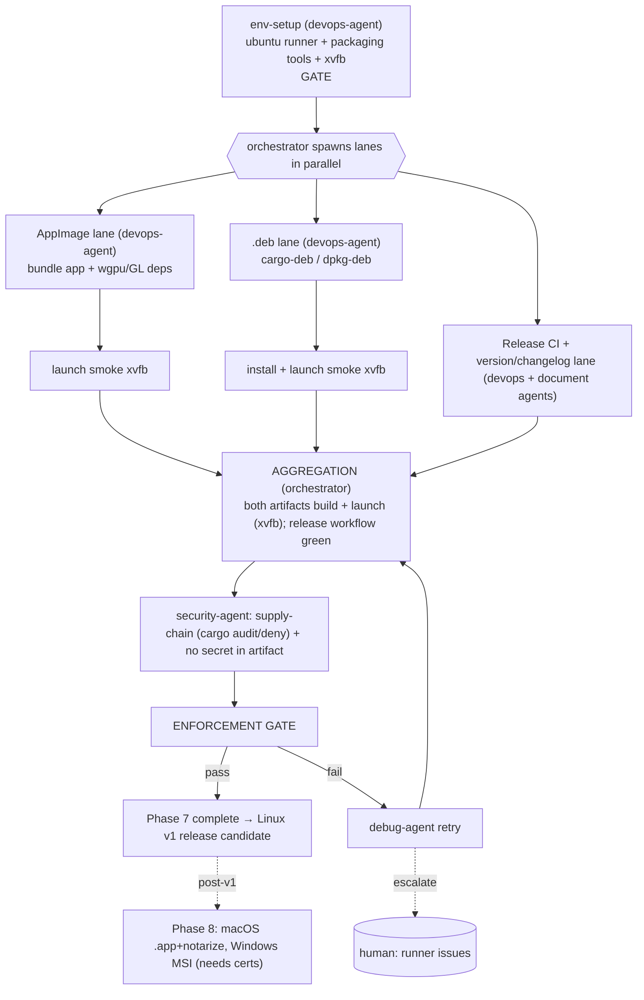

# PHASE 7 — Packaging (Linux v1) (Multiagent Execution Plan)

**Status:** Draft (awaiting approval) · **References:** [MASTER.md](./MASTER.md) ·
scope per [MASTER Revisions R2b](./MASTER.md#revisions) (**Linux-only v1**)
**Goal:** Produce installable **Linux** artifacts — **AppImage** + **.deb** — wired into a
release CI workflow with versioning/changelog. macOS/Windows are deferred to **Phase 8** (post-v1).
**Exit criteria:** AppImage and .deb build in CI and **launch on Linux** (headless smoke via
xvfb); release workflow green; supply-chain audit clean; no secret baked into any artifact.

> **Deferred to Phase 8 (R2b):** macOS `.app` + codesign + notarization, Windows MSI + signtool,
> and the Apple/Windows signing certs (former blocker B6) — **out of v1 scope**, no certs needed now.

---

## 1. Conventions loaded
Per [MASTER §1](./MASTER.md). New tooling flag: `cargo-dist` (or `cargo-bundle` + `appimagetool`
+ `dpkg-deb`) — packaging-only. Versioning/changelog follow the Conventional-Commits convention
ratified in Phase 0; changelog by document-agent. No PAT involved (R2a is moot here — packaging
touches no GitHub API).

## 2. Environment manifest (Step 4)

| Service / process | Purpose | Start (pipeline-owned) | Health check | Stop |
|---|---|---|---|---|
| Ubuntu CI runner | build+package+smoke | GitHub Actions (Linux) | runner online | — |
| `cargo-dist` (or bundlers) | artifact build | `cargo install cargo-dist` | `cargo dist --version` | — |
| `appimagetool` + linuxdeploy | AppImage | install in CI | tool `--version` | — |
| `dpkg-deb` / `cargo-deb` | .deb | install in CI | `cargo deb --version` | — |
| Iced/wgpu runtime libs + `xvfb` (B5) | launch smoke | start `Xvfb :99`; software GL | app exits 0 after launch | kill Xvfb |

No human input required (no certs in v1).

## 3. Execution map (Step 6.4)

## 4. Lanes & subagent specification (Step 6.5)

| Subagent | Parent | Scope | Inputs | Outputs | Convention constraints | Depends on |
|---|---|---|---|---|---|---|
| env-setup | devops-agent | §2 | ubuntu runner | ready toolchain | MASTER §4 | gate |
| pkg-appimage | devops-agent | AppImage bundling app + wgpu/GL libs correctly | release build | AppImage artifact | reproducible build | env-setup |
| pkg-deb | devops-agent | .deb via `cargo-deb`; correct depends/metadata | release build | .deb artifact | reproducible | env-setup |
| smoke-appimage / smoke-deb | devops-agent (subagents) | install/run artifact under xvfb, assert clean launch+exit | artifacts | smoke results | real launch | pkg-* |
| release-ci | devops-agent | release workflow (tag → build → upload AppImage+.deb) | pkg lanes | `.github/workflows/release.yml` | YAML lint clean; Linux-only matrix (extensible) | env-setup |
| versioning | document-agent | semver + changelog from Conventional Commits | git history | CHANGELOG.md + version bump | Conventional Commits | env-setup |
| sec-supplychain | security-agent | `cargo audit`/`cargo deny`; assert no secret/PAT/token baked into artifact | artifacts, deps | audit report | privacy invariant | pkg-* |

**Understanding requirement (§3.6):** pkg-appimage must justify the **dependency-bundling
strategy** (why AppImage bundles GL/wgpu libs rather than relying on host libs — portability
across Linux distros) vs .deb (declares system `depends`) — not blindly run a bundler template.

## 5. Convention enforcement (Step 6.6)
- enforcement-agent: versioning = Conventional Commits (Phase-0 ratified); **no secrets in
  artifacts** (security-agent confirms — directly serves the privacy invariant); reproducible
  release build; no-stub; release workflow structured so Phase 8 adds mac/win as matrix entries.

## 6. Test strategy (Step 6.7)
- **ATDD:** AppImage and .deb each install and launch to the main window without error (CI smoke
  via xvfb).
- **TDD:** packaging metadata correctness (version stamp, .deb control fields, AppImage desktop
  entry); the full prior-phase test suite must still pass on the release (optimized) build.

## 7. Integration verification (Step 6.8)
Boundary: **artifact ↔ Linux** — verified by a real install + launch smoke under xvfb for both
AppImage and .deb. No signing/notarization in v1 (deferred to Phase 8). No GitHub API boundary.

## 8. Gap report (Step 6.9)
- **B5**: launch smoke via xvfb/software GL; if a runner lacks software GL → blocker, escalate.
- **B6 retired for v1 (R2b):** signing certs only needed in Phase 8.
- Distro coverage: AppImage targets broad compatibility; .deb targets Debian/Ubuntu. Other
  package formats (rpm, Flatpak) are out of v1 scope — flagged, not silently dropped.

## 9. Debug & retry (Step 6.10)
Per [MASTER §8](./MASTER.md). Likely: missing runtime libs at launch (AppImage bundle fix), .deb
dependency declaration errors, xvfb/GL flakiness (force software adapter). Escalate on
runner-access issues.

## 10. Aggregation & gate
orchestrator: both artifacts build + launch (xvfb) + release workflow green → **security-agent**
supply-chain + no-secret audit → enforcement-agent → session update → Phase 7 closed →
**Linux v1 release candidate** (Phase 8 = mac/win, post-v1).
