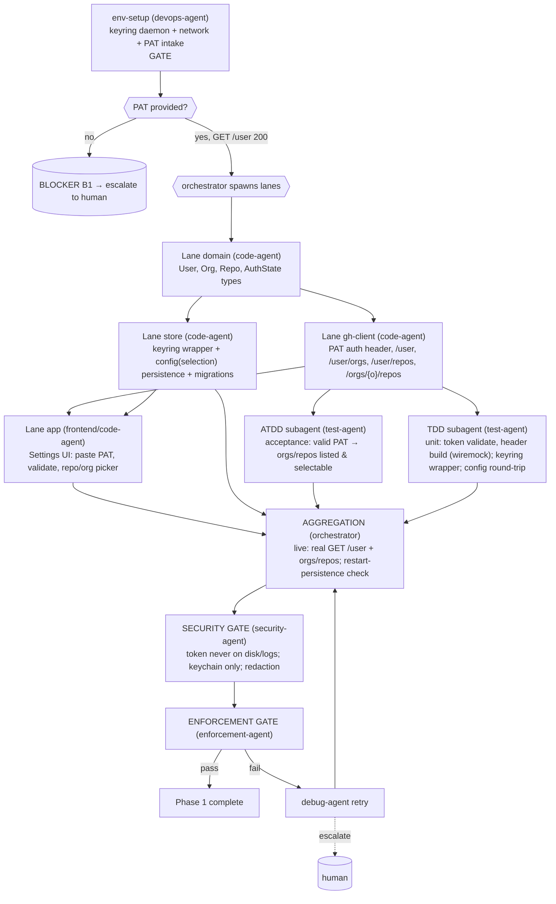

# PHASE 1 — Auth + Scope (Multiagent Execution Plan)

**Status:** Draft (awaiting approval) · **References:** [MASTER.md](./MASTER.md)
**Goal:** PAT entry → OS keychain; validate token; list user orgs/repos; persist selection.
**Exit criteria:** with a real PAT, the app authenticates (`GET /user` 200), lists the user's
orgs & repos, lets the user select a subset, and the selection survives restart. Token lives in
the keychain only. **First phase that touches a real external boundary.**

---

## 1. Conventions loaded
Per [MASTER §1](./MASTER.md). New-dep flag: `keyring`, `directories` (both in ARD AD-8).

## 2. Environment manifest (Step 4)

| Service / process | Purpose | Start (pipeline-owned) | Health check | Stop |
|---|---|---|---|---|
| Phase-0 toolchain + xvfb + watchers | build/run/test | reuse Phase-0 setup | as Phase 0 | as Phase 0 |
| **dbus + gnome-keyring-daemon** (Linux) | Secret Service for `keyring` (B3) | start dbus session; `gnome-keyring-daemon --start --components=secrets`; unlock with throwaway pass | write+read a probe secret | kill daemons |
| Network egress to `api.github.com` | real auth/scope calls | verify reachability | `curl -sI https://api.github.com` 200 | n/a |
| **GitHub fine-grained PAT** (B1) | auth | **cannot be pipeline-minted** | `GET /user` returns 200 + login | user revokes |
| SQLite (bundled via rusqlite) | persist selection/config | n/a (embedded) | open temp db, run migration | n/a |

**Hard human input (blocker B1):** env-setup pauses at the gate and requests the PAT once. Until
provided, all downstream lanes stay blocked (no stub token). This is the one infra item the
pipeline cannot own (MASTER §3.5 exception).

## 3. Execution map (Step 6.4)

## 4. Lanes & subagent specification (Step 6.5)

| Subagent | Parent | Scope | Inputs | Outputs | Convention constraints | Depends on |
|---|---|---|---|---|---|---|
| env-setup | devops-agent | §2 incl. PAT intake | host, PAT (from you) | keyring up, network ok, PAT validated | MASTER §4 | gate |
| domain-auth-types | code-agent | `User{login,type}`, `Org`, `Repo`, `AuthState`, `RepoSelection` | ARD AD-5 | typed crate additions | derives Serde/Debug/Clone; one-type-per-file | env-setup |
| ghc-auth | code-agent | auth header injection, `GET /user`, `/user/orgs`, `/user/repos`, `/orgs/{o}/repos` (paginated) | domain types | functions returning `Result<…, GhError>` | thiserror `GhError`; no panics; real reqwest | domain-auth-types |
| store-keyring | code-agent | `keyring` wrapper (set/get/delete token), config table + selection persistence + migration v1 | domain types | store API | token only via keyring; sqlite for selection | domain-auth-types |
| app-settings | code-agent (frontend hat) | Iced settings view: PAT field (masked), Validate button, org/repo multi-select, persist | ghc-auth, store-keyring | working settings screen | no token in widget logs; accessible labels | ghc-auth, store-keyring |
| atdd-auth | test-agent (ATDD) | acceptance scenarios (valid/invalid PAT, scope select, restart persistence) | §7 | live acceptance tests | real API (gated B1) | ghc-auth |
| tdd-auth | test-agent (TDD) | unit: header build + validate (wiremock), keyring wrapper (real daemon), config round-trip; integration: real `/user` | §7 | passing tests + coverage | wiremock unit-only; real API integration | ghc-auth, store-keyring |

**Understanding requirement (§3.6):** store-keyring must justify *why* OS keychain (not an
encrypted file) — OS-managed secret lifecycle, per-user isolation, no key-management burden —
tied to the privacy invariant.

## 5. Convention enforcement (Step 6.6)
- security-agent gate: assert token never written to sqlite, config files, or logs (grep + log
  capture); masked in UI; `Debug` impls redact it.
- thiserror error taxonomy reviewed (`GhError`: Network, Unauthorized, RateLimited, Decode…).
- no-stub scan; fmt/clippy gates; new-dep check (keyring/directories only).

## 6. Test strategy (Step 6.7)
- **ATDD:** valid PAT → orgs+repos appear & selectable; invalid PAT → clear error, no crash;
  selection persists across restart.
- **TDD:** token validation, paginated repo listing (wiremock), keyring set/get/delete against
  the real daemon, config serialization round-trip. **Integration:** real `GET /user` +
  `/user/repos` with the provided PAT.

## 7. Integration verification (Step 6.8)
Boundaries: **GitHub REST auth/scope** and **OS keychain**. Verified by live `GET /user` (200 +
matching login), live org/repo enumeration returning real data, and a keychain write→read→delete
probe through `keyring`. Unverifiable (no PAT / no Secret Service) = blocker, not bypassed.

## 8. Gap report (Step 6.9)
- **B1 PAT** — required; pipeline pauses for it. **B3 keyring daemon** — pipeline starts it;
  headless CI uses mock backend for *unit* only, real daemon for integration. **B2 fixtures** —
  the user's own account satisfies org/repo listing; no special sandbox needed yet.

## 9. Debug & retry (Step 6.10)
Per [MASTER §8](./MASTER.md). Likely failures: PAT scope too narrow (escalate — ask you to widen
scopes), Secret Service not running (re-run env-setup), pagination edge (subagent retry).

## 10. Aggregation & gate
orchestrator: live auth + scope + restart-persistence green → **security-agent** sign-off
(token hygiene) → enforcement-agent → session update → Phase 1 closed.
