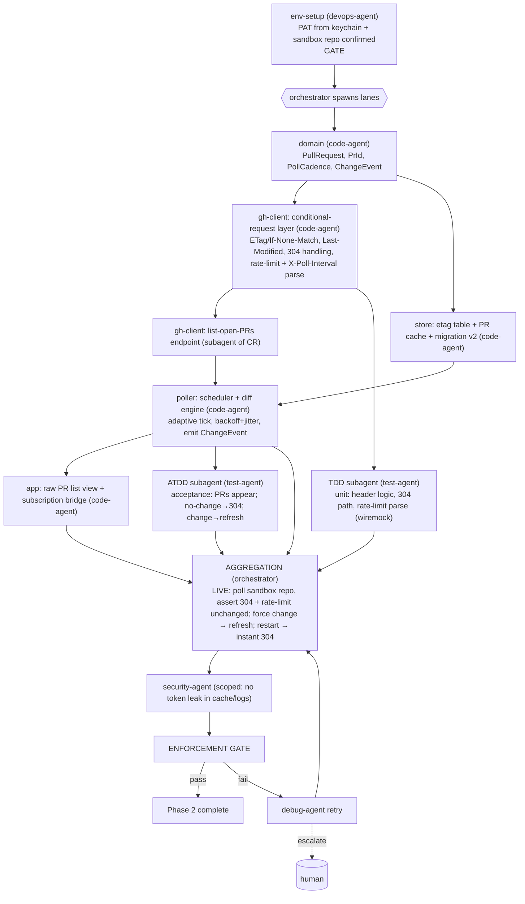

# PHASE 2 — Poller Core (Multiagent Execution Plan)

**Status:** Draft (awaiting approval) · **References:** [MASTER.md](./MASTER.md)
**Goal:** Conditional-request polling engine: list open PRs for selected repos, persist ETags,
diff against cache, show a raw list that refreshes cheaply (304s).
**Exit criteria:** poller runs on a cadence honoring `X-Poll-Interval`; repeated polls with no
change return `304 Not Modified` and **do not consume rate limit** (observed in logs/headers);
open PRs render and update; ETags survive restart (immediate 304 on launch).

---

## 1. Conventions loaded
Per [MASTER §1](./MASTER.md). New-dep flag: none beyond ARD (reqwest/tokio already in AD-8).

## 2. Environment manifest (Step 4)

| Service / process | Purpose | Start | Health check | Stop |
|---|---|---|---|---|
| Phase-0/1 toolchain, keyring, network | build/run/auth | reuse | as before | as before |
| **GitHub PAT** (B1) | real polls | from keychain (Phase 1) | `GET /user` 200 | — |
| **Sandbox repo with open PRs** (B2) | verify list + 304 + change-detect | you designate a repo you control (so we can open/close a PR to force change) | repo returns ≥1 open PR | — |
| tokio runtime | async poll loop | in-process | loop tick logged | app exit |

**Blocker note:** B2 — to *prove* both 304-on-no-change and refresh-on-change we need a repo we
can mutate. Pipeline cannot create org repos for you silently; you nominate one (or approve
pipeline creating a throwaway repo under your account via API if PAT allows `repo` create).

## 3. Execution map (Step 6.4)

## 4. Lanes & subagent specification (Step 6.5)

| Subagent | Parent | Scope | Inputs | Outputs | Convention constraints | Depends on |
|---|---|---|---|---|---|---|
| env-setup | devops-agent | §2, confirm sandbox repo | PAT, repo | ready env | MASTER §4 | gate |
| domain-poll-types | code-agent | `PullRequest`, `PrId`, `PollCadence`, `ChangeEvent`, `RateLimitState` | ARD | types | derives; one-type-per-file | env-setup |
| ghc-conditional | code-agent | conditional-request middleware: store/send ETag+Last-Modified, map 304, parse `X-RateLimit-*` + `X-Poll-Interval` | domain | reusable request layer | thiserror; **must demonstrate why conditional requests (304 free) fit low-impact goal** | domain |
| ghc-list-prs | code-agent (subagent of ghc-conditional) | `GET /repos/{o}/{r}/pulls?state=open` paginated via the conditional layer | ghc-conditional | typed PR lists + etag | per-repo etag keyed | ghc-conditional |
| store-etag-cache | code-agent | `etags` table, PR cache table, migration v2, restart-load | domain | persistence API | snake_case tables | domain |
| poller-core | code-agent | tokio scheduler (adaptive tick), diff cache vs fresh, emit `ChangeEvent`, backoff+jitter, obey `X-Poll-Interval` | ghc-list-prs, store-etag-cache | running poll loop | no busy-wait; cancellation-safe | ghc-list-prs, store-etag-cache |
| app-prlist | code-agent | Iced subscription bridge + raw PR list view | poller-core | live list | redraw-on-event only | poller-core |
| tdd-poller | test-agent (TDD) | unit: 304 path, etag persistence, diff engine, rate-limit/poll-interval parse (wiremock); integration: real poll | §7 | passing tests | wiremock unit-only | ghc-conditional, store-etag-cache |
| atdd-poller | test-agent (ATDD) | acceptance: appear / 304-no-change / refresh-on-change / restart-304 | §7 | live acceptance | real sandbox repo | poller-core |

**Understanding requirement (§3.6):** poller-core must justify the **diff-then-event** design
(retained-mode UI consumes events; avoids full re-render) and the **adaptive-cadence + jitter**
choice (thundering-herd avoidance, low idle cost) — not copy a generic polling loop.

## 5. Convention enforcement (Step 6.6)
- enforcement-agent: thiserror taxonomy extended (`RateLimited{reset_at}`), no panics in loop,
  cancellation-safety, no token in cache rows/logs.
- no-stub scan (the diff engine must be real); fmt/clippy; cadence values from config not magic.

## 6. Test strategy (Step 6.7)
- **ATDD:** (a) open PRs of sandbox repo listed; (b) second poll with no change → 304 and
  `X-RateLimit-Remaining` unchanged; (c) open a new PR via API → next poll shows it; (d) restart
  → first poll is 304 from persisted ETag.
- **TDD:** conditional header construction, 304 short-circuit, ETag store CRUD, diff (added/
  removed/updated), rate-limit + poll-interval header parsing (wiremock).

## 7. Integration verification (Step 6.8)
Boundary: **GitHub REST list + conditional-request semantics**. Verified live by asserting an
actual `304` response *and* that `X-RateLimit-Remaining` did not decrement — the concrete proof
that AD-1's "free idle polling" holds. Change-detection verified by mutating the sandbox repo.

## 8. Gap report (Step 6.9)
- **B2** mutable sandbox repo is the key dependency this phase; without it the 304/refresh
  acceptance can't be fully proven → blocker. Fallback: read-only public repo proves listing +
  304 but not refresh-on-change; flagged as partial.

## 9. Debug & retry (Step 6.10)
Per [MASTER §8](./MASTER.md). Likely: server returns 200 instead of 304 (etag not echoed
correctly — subagent retry on header logic); rate-limit hit during tests (backoff + lower test
cadence). Escalate if GitHub semantics differ from AD-1 assumptions (material change → re-present).

## 10. Aggregation & gate
orchestrator runs the live 304/refresh/restart proof → security-agent (token hygiene in cache)
→ enforcement-agent → session update → Phase 2 closed.
