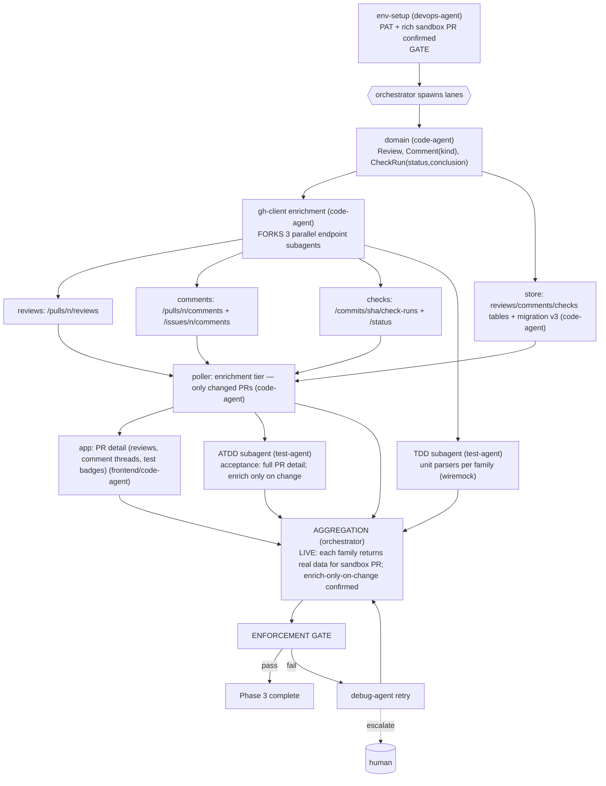

# PHASE 3 — Enrichment (Multiagent Execution Plan)

**Status:** Draft (awaiting approval) · **References:** [MASTER.md](./MASTER.md)
**Goal:** For changed PRs, fetch reviews, comments (issue + review), and check-runs/status (test
results); render pass/fail/pending and comments in the feed.
**Exit criteria:** each open PR shows its reviews, comment threads (attributed), and test-result
status; enrichment only fires for PRs that changed (cheap); all three endpoint families verified
live against the sandbox repo.

---

## 1. Conventions loaded
Per [MASTER §1](./MASTER.md). No new runtime deps (still REST; GraphQL deferred per ARD AD-3/AD-9).

## 2. Environment manifest (Step 4)

| Service / process | Purpose | Start | Health check | Stop |
|---|---|---|---|---|
| Phase-0..2 env (toolchain, keyring, network, tokio) | base | reuse | as before | as before |
| **PAT** (B1) | enrichment calls | keychain | 200 | — |
| **Sandbox repo with a PR that has reviews, comments, and a CI run** (B2) | verify all 3 families | you provision: open a PR, add a review + comment, ensure a workflow runs | endpoints return non-empty | — |

**Blocker note:** B2 must now contain *rich* data (a reviewed, commented PR with a CI run). If
the sandbox lacks any family, that family's integration can't be verified → flagged.

## 3. Execution map (Step 6.4)

## 4. Lanes & subagent specification (Step 6.5)

| Subagent | Parent | Scope | Inputs | Outputs | Convention constraints | Depends on |
|---|---|---|---|---|---|---|
| env-setup | devops-agent | §2, confirm rich PR | PAT, repo | ready env | MASTER §4 | gate |
| domain-enrich-types | code-agent | `Review`, `Comment{kind: Issue\|Review}`, `CheckRun{status, conclusion}`, `TestSummary` | ARD | types | derives; one-type-per-file | env-setup |
| ghc-reviews | code-agent (subagent of enrichment) | `GET /pulls/{n}/reviews` conditional | domain, Phase-2 layer | typed reviews | reuse conditional layer | domain |
| ghc-comments | code-agent (subagent) | issue + review comments, merged + attributed | domain | typed comments | reuse layer | domain |
| ghc-checks | code-agent (subagent) | check-runs + combined status → `TestSummary(pass/fail/pending)` | domain | typed checks | reuse layer | domain |
| store-enrich | code-agent | tables for reviews/comments/checks + migration v3 | domain | persistence | snake_case | domain |
| poller-enrich | code-agent | enrichment tier: trigger only for PRs whose change-detect (Phase 2) fired | ghc-*, store-enrich | enriched events | no full refetch | ghc-*, store-enrich |
| app-prdetail | code-agent (frontend hat) | render reviews, threaded comments, test badges | poller-enrich | detail UI | accessible; redraw-on-event | poller-enrich |
| tdd-enrich | test-agent (TDD) | per-family parser units (wiremock) + integration live | §7 | passing tests | wiremock unit-only | ghc-* |
| atdd-enrich | test-agent (ATDD) | acceptance: full detail; enrich fires only on change | §7 | live acceptance | real sandbox | poller-enrich |

**Understanding requirement (§3.6):** poller-enrich must justify **two-tier** design (cheap
change-detect → targeted enrich) over refetch-all (rate-limit + CPU), tying back to AD-3.

## 5. Convention enforcement (Step 6.6)
- enforcement-agent: comment attribution carries author identity for Phase-4 classification; no
  N+1 explosion (batch per changed PR); thiserror per family; no-stub; fmt/clippy.

## 6. Test strategy (Step 6.7)
- **ATDD:** sandbox PR shows its real reviews, comments (correct author + kind), and test status;
  an unchanged PR triggers **no** enrichment calls (assert via request log).
- **TDD:** parser units for each family incl. empty/paginated/failure payloads (wiremock);
  status→summary mapping (success/failure/neutral/pending). Integration: live per-family fetch.

## 7. Integration verification (Step 6.8)
Boundaries: **reviews, comments (×2), check-runs/status**. Each verified by a live call against
the rich sandbox PR returning the expected real entities. Enrichment-gating verified by request
log showing zero enrich calls on a no-change cycle.

## 8. Gap report (Step 6.9)
- B2 richness: if the sandbox lacks reviews/CI, those families fall back to a named public PR
  (read-only) for verification; flagged as partial if even that is unavailable.

## 9. Debug & retry (Step 6.10)
Per [MASTER §8](./MASTER.md). Likely: status vs check-runs ambiguity (a repo may use one or both)
→ subagent reconciles both into `TestSummary`; pagination on busy PRs → retry.

## 10. Aggregation & gate
orchestrator: live three-family proof + enrich-only-on-change → enforcement-agent → session
update → Phase 3 closed.
