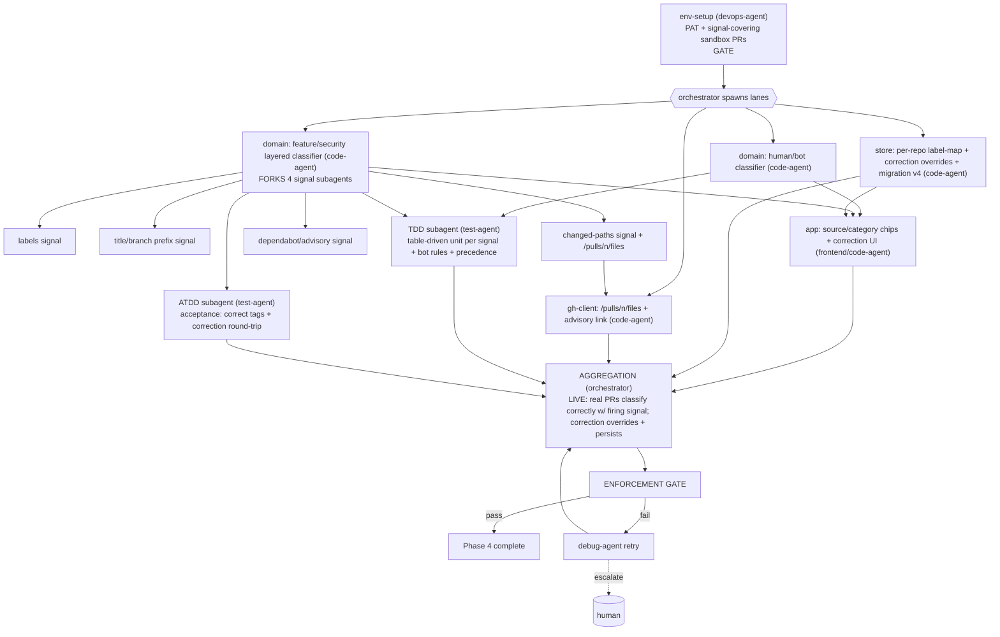

# PHASE 4 — Classification (Multiagent Execution Plan)

**Status:** Draft (awaiting approval) · **References:** [MASTER.md](./MASTER.md)
**Goal:** Tag every actor Human/Bot; classify every PR Feature/Security/Other via the layered
classifier (labels → title/branch prefix → changed paths → Dependabot/advisory); allow user
correction that feeds per-repo config.
**Exit criteria:** items show correct Human/Bot + category with the firing signal; corrections
persist and override; classifiers are pure and exhaustively unit-tested; verified against real PRs.

---

## 1. Conventions loaded
Per [MASTER §1](./MASTER.md). Mostly **pure-`domain`** work → heaviest unit-test phase. New data
need: changed-paths requires `GET /pulls/{n}/files` (REST, conditional) — no new dep.

## 2. Environment manifest (Step 4)

| Service / process | Purpose | Start | Health check | Stop |
|---|---|---|---|---|
| Phase-0..3 env | base | reuse | as before | as before |
| **PAT** (B1) | fetch `/pulls/{n}/files` + advisory links | keychain | 200 | — |
| **Sandbox PRs covering each signal** (B2) | verify classifier paths | you provision: a labeled-security PR, a `feat/`-branch PR, a PR touching `auth/`, and a Dependabot security PR | each present | — |

Note: classification is mostly pure logic; the only new boundary is `/pulls/{n}/files` and
advisory linkage. Env need is light beyond fixtures.

## 3. Execution map (Step 6.4)

## 4. Lanes & subagent specification (Step 6.5)

| Subagent | Parent | Scope | Inputs | Outputs | Convention constraints | Depends on |
|---|---|---|---|---|---|---|
| env-setup | devops-agent | §2, confirm signal-covering PRs | PAT, repo | ready env | MASTER §4 | gate |
| bot-classifier | code-agent | `type=="Bot"` \|\| login ends `[bot]` + allow/deny overrides → `Source` | domain (User) | pure fn + tests | pure, no I/O | env-setup |
| sec-classifier | code-agent | orchestrates 4 signals, first-confident-wins, records `signal` + `confidence` | signal subagents | `Category{kind,confidence,signal}` | pure; precedence explicit | env-setup |
| sig-labels | code-agent (subagent) | configurable label→category map | store label-map | partial verdict | pure | sec-classifier |
| sig-prefix | code-agent (subagent) | title/branch prefix rules (`security/*`,`feat:`,`fix(sec):`) | PR title/branch | partial verdict | pure | sec-classifier |
| sig-paths | code-agent (subagent) | sensitive globs over `/pulls/{n}/files` | ghc-files | partial verdict | pure (paths injected) | ghc-files |
| sig-dependabot | code-agent (subagent) | Dependabot author + advisory linkage → Security | PR author/links | partial verdict | pure | sec-classifier |
| ghc-files | code-agent | `GET /pulls/{n}/files` conditional | Phase-2 layer | changed paths | reuse layer | env-setup |
| store-class | code-agent | per-repo label-map + correction overrides + migration v4 | domain | persistence | snake_case | env-setup |
| app-classify | code-agent (frontend hat) | Source/Category chips, "why" tooltip (firing signal), correction control | classifiers, store | UI | accessible; redraw-on-event | bot/sec-classifier, store-class |
| tdd-class | test-agent (TDD) | exhaustive table-driven units per signal, precedence, bot edge cases, correction override | §7 | passing tests, high coverage | pure-fn tests, no mocks needed | classifiers |
| atdd-class | test-agent (ATDD) | acceptance: 4 sandbox PRs tag correctly w/ signal; correction persists & overrides | §7 | live acceptance | real PRs | app-classify |

**Understanding requirement (§3.6):** sec-classifier must justify **layered precedence** (why
labels outrank heuristics; why "first confident wins" with recorded signal beats a single
opaque score) and how correction feedback avoids fighting the user — not a generic if/else chain.

## 5. Convention enforcement (Step 6.6)
- enforcement-agent: classifiers strictly pure (no I/O in `domain`); deterministic; precedence
  documented; correction override path tested; no-stub; fmt/clippy. Coverage target enforced
  hardest here (pure logic, ≥ 90% achievable).

## 6. Test strategy (Step 6.7)
- **ATDD:** the four signal-covering sandbox PRs each classify to the expected category with the
  expected firing signal; user correction on one persists and overrides re-classification.
- **TDD:** table-driven matrices per signal (incl. conflicting signals → precedence), bot
  login/type edge cases, allow/deny overrides, empty-files PR, advisory-linked PR.

## 7. Integration verification (Step 6.8)
Boundaries: `/pulls/{n}/files` and advisory linkage (live). Classification logic itself is
internal/pure — verified by feeding **real fetched PR data** through the pure classifiers and
asserting outputs match the known sandbox PRs (no mock substitution for the verdict).

## 8. Gap report (Step 6.9)
- B2 coverage: needs one PR per signal. If a Dependabot security PR can't be produced on demand,
  fall back to a named public Dependabot PR (read-only) for that signal's verification; flag.

## 9. Debug & retry (Step 6.10)
Per [MASTER §8](./MASTER.md). Likely: signal conflicts producing surprising precedence → debug
+ table test added; path-glob false positives → tighten globs (config-driven, not hardcoded).

## 10. Aggregation & gate
orchestrator: live classification proof + correction round-trip → enforcement-agent (purity +
coverage) → session update → Phase 4 closed.
