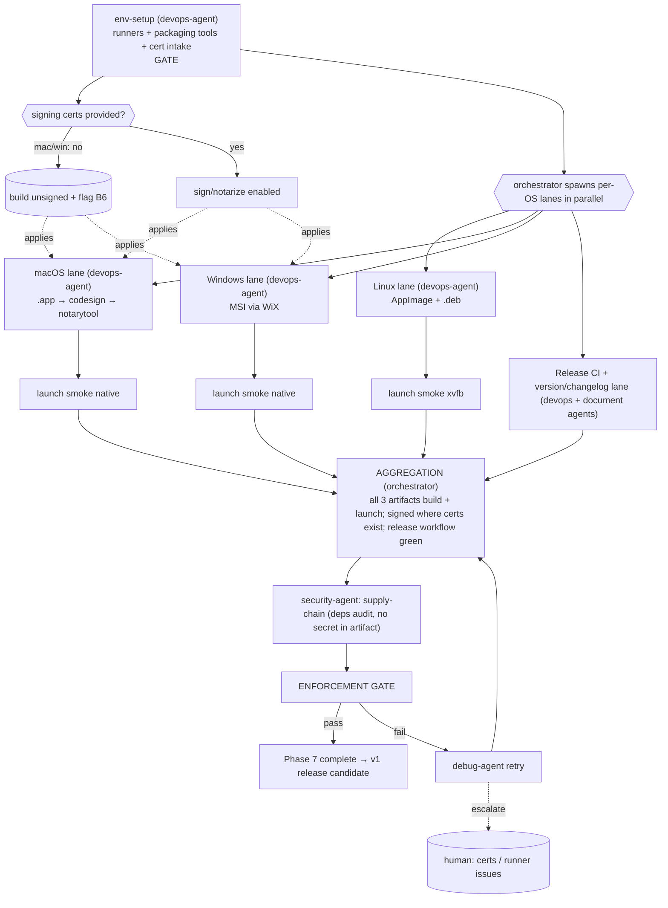

# PHASE 7 — Packaging (Multiagent Execution Plan)

**Status:** Draft (awaiting approval) · **References:** [MASTER.md](./MASTER.md)
**Goal:** Produce installable artifacts per OS — Linux (AppImage + .deb), macOS (.app, signed +
notarized), Windows (MSI) — wired into a release CI workflow with versioning/changelog.
**Exit criteria:** each artifact builds in CI and **launches on its target OS** (smoke); signed/
notarized where certs are available; unsigned + flagged where not.

---

## 1. Conventions loaded
Per [MASTER §1](./MASTER.md). New tooling flag: `cargo-dist` (or `cargo-bundle` + `cargo-wix` +
`appimagetool`) — packaging-only deps. Commit/versioning follows the Conventional-Commits
convention ratified in Phase 0; changelog by document-agent.

## 2. Environment manifest (Step 4)

| Service / process | Purpose | Start (pipeline-owned) | Health check | Stop |
|---|---|---|---|---|
| Per-OS CI runners (ubuntu/macos/windows) | build+package+smoke | GitHub Actions matrix | runner online | — |
| `cargo-dist` (or bundlers) | artifact build | `cargo install cargo-dist` | `cargo dist --version` | — |
| Linux: `appimagetool`, `dpkg-deb`, linuxdeploy | AppImage/.deb | install in CI | tool `--version` | — |
| Windows: WiX / `cargo-wix` | MSI | install in CI | `cargo wix --version` | — |
| macOS: Xcode CLT, `codesign`, `notarytool` | sign/notarize | install in CI | `xcrun notarytool --help` | — |
| xvfb (Linux) / native (mac/win) | launch smoke (B5) | start per runner | app exits 0 after launch | — |
| **Apple Developer ID cert + Windows signing cert** (B6) | sign/notarize | **cannot be pipeline-minted** | cert present in CI secrets | — |

**Blocker note:** B6 — signing/notarization needs certs only you can provide (Apple Developer
account; Windows code-signing cert). Pipeline builds **unsigned** artifacts and flags the gap;
when certs are supplied as CI secrets, the signing lanes activate. No fake signing.

## 3. Execution map (Step 6.4)

## 4. Lanes & subagent specification (Step 6.5)

| Subagent | Parent | Scope | Inputs | Outputs | Convention constraints | Depends on |
|---|---|---|---|---|---|---|
| env-setup | devops-agent | §2, cert intake (optional) | runners, certs? | ready toolchains | MASTER §4 | gate |
| pkg-linux | devops-agent | AppImage + .deb via bundler; bundle wgpu/GL deps correctly | release build | Linux artifacts | reproducible build | env-setup |
| pkg-macos | devops-agent | .app bundle; if cert: codesign + notarytool + staple | release build, cert? | macOS artifact (signed or flagged) | no fake signing | env-setup |
| pkg-windows | devops-agent | MSI via WiX; if cert: signtool | release build, cert? | MSI (signed or flagged) | no fake signing | env-setup |
| smoke-linux/mac/win | devops-agent (subagents) | install/run artifact, assert clean launch+exit | artifacts | smoke results | real launch (xvfb/native) | pkg-* |
| release-ci | devops-agent | release workflow (tag → build matrix → upload artifacts) | pkg lanes | `.github/workflows/release.yml` | YAML lint clean | env-setup |
| versioning | document-agent | semver + changelog from Conventional Commits | git history | CHANGELOG.md + version bump | Conventional Commits | env-setup |
| sec-supplychain | security-agent | `cargo audit`/`cargo deny`; assert no secret/PAT baked into artifact | artifacts, deps | audit report | privacy invariant | pkg-* |

**Understanding requirement (§3.6):** pkg-linux must justify dependency bundling strategy (why
AppImage bundles GL/wgpu libs vs relying on host) and macOS lane must justify notarization need
(Gatekeeper) — not blindly run a bundler template.

## 5. Convention enforcement (Step 6.6)
- enforcement-agent: versioning = Conventional Commits (Phase-0 ratified); no secrets in
  artifacts (security-agent confirms — directly serves the privacy invariant); reproducible
  release build; no-stub.

## 6. Test strategy (Step 6.7)
- **ATDD:** each artifact, on its OS, installs and launches to the main window without error
  (CI smoke); signed artifacts pass `spctl`/`signtool verify` where certs exist.
- **TDD:** packaging scripts validated (manifest correctness, version stamping); full app test
  suite from prior phases must still pass on the release build.

## 7. Integration verification (Step 6.8)
Boundaries: **artifact ↔ each OS** (real install + launch smoke) and **signing/notarization
services** (Apple notary, Windows signing) when certs present — verified by `spctl --assess` /
`signtool verify`. No simulated signing.

## 8. Gap report (Step 6.9)
- **B6** signing certs: hard blocker for signed/notarized output; unsigned artifacts produced +
  flagged until provided. **B5** launch smoke: Linux via xvfb; mac/win via native runners.
  Cross-compilation avoided — each OS built on its own runner.

## 9. Debug & retry (Step 6.10)
Per [MASTER §8](./MASTER.md). Likely: notarization rejection (entitlements/hardened runtime →
debug-agent adjusts), missing runtime libs at launch (bundle fix), MSI component errors. Escalate
on cert/runner-access issues (B6).

## 10. Aggregation & gate
orchestrator: all three artifacts build + launch (signed where possible) + release workflow green
→ **security-agent** supply-chain + no-secret audit → enforcement-agent → session update →
Phase 7 closed → **v1 release candidate**.
